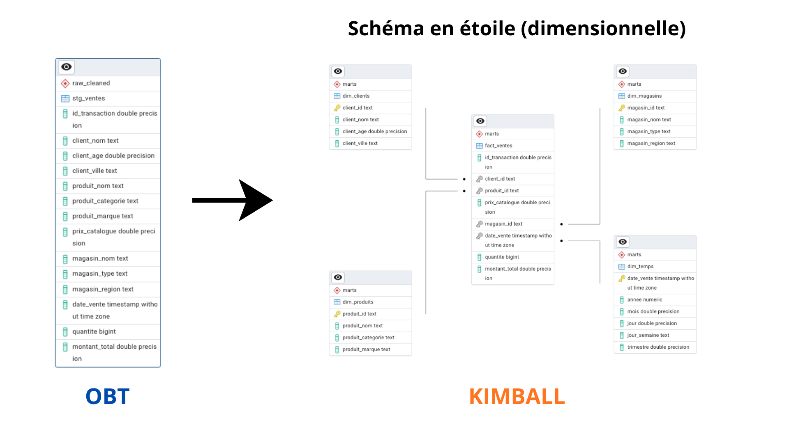

# Projet — Introduction à Apache PySpark & dbt

Ce projet est composé de **2 parties** et a pour objectif une prise en main pratique de PySpark (nettoyage) et dbt (modélisation). Le notebook sert d'espace d'exploration et de tests.

- Le script `clean_data.py` contient la logique de production pour nettoyer le jeu de données.
- Le script `load_data.py` se charge de l'insertion des données nettoyées dans PostgreSQL.

# Pré-requis

## Arborescence (essentielle)
```
├─ data/
│  └─ ventes.csv           # fichier source brut
├─ clean_data.py           # nettoyage (Spark)
├─ load_data.py            # chargement dans PostgreSQL
├─ postgres (models)/      # projet dbt avec les models (marts + analyses)
├─ ERD_postgres.sql        # script création relations dimensionnelles dans Postgres
├─ requirements.txt
└─ Notebooks.ipynb         # explorations et tests
```

## Environnement 

1. Python 3.8+

2. PostgreSQL opérationnel (ou accès à une instance)

3. Créer les schémas `raw_cleaned` et `marts` dans la base de données PostgreSQL

4. Créer un environnement virtuel et installer les dépendances :
```bash
python -m venv .venv
source .venv/bin/activate    # ou .venv\Scripts\activate sous Windows
pip install -r requirements.txt
```

5. Placer le fichier brut `ventes.csv` dans le dossier `data/`.

6. Définir les variables d'environnement pour la connexion PostgreSQL (ex. dans `.env` ou `export`)

# Partie 1 — Nettoyage & Chargement

## 1. Nettoyage

Pour ce faire, exécuter `clean_data.py` qui va nettoyer les données :
```bash
python clean_data.py
```

Après exécution, le dossier `data/` contiendra :

- `ventes_clean.csv` — données nettoyées prêtes à être chargées
- `ventes_rejetees.csv` — lignes rejetées / invalides

## 2. Chargement

L'objectif est d'importer les données nettoyées dans PostgreSQL.
Pour ce faire, exécuter :
```bash
python load_data.py
```

Ce script lit `ventes_clean.csv` et alimente la table source `stg_ventes` dans le schéma `raw_cleaned`.

**Remarque** : les notebooks servent uniquement à l'exploration et à la mise au point des règles de nettoyage ; ne pas les exécuter pour la production.

# Partie 2 — Modélisation (dbt)

1. Dans le répertoire du projet dbt : `postgres`, initialiser / activer l'environnement dbt si nécessaire.

2. Lancer la construction des modèles avec :
```bash
dbt run
```

Cette commande exécutera :

- `models/marts/core` : création des différentes tables pour l'architecture en étoile (schéma en étoile — logique ETL/ELT)
- `models/marts/analyses` : requêtes métiers qui vont générer une vue pour chaque question, disponibles dans le schéma `marts`

**Important** : dbt génère les tables / modèles logiques dans la base cible, mais ne matérialise pas automatiquement les relations physiques (contraintes FK, etc.) dans PostgreSQL.

## Matérialisation du schéma dimensionnel dans PostgreSQL

Pour créer physiquement les relations (contraintes, clés étrangères) dans PostgreSQL, exécutez le script :
```sql
-- depuis psql ou pgAdmin
\i path/to/ERD_postgres.sql
```

Cela matérialisera le schéma en étoile dans votre instance PostgreSQL comme suit :



En suivant toutes les étapes comme indiqué ci-dessus, vous obtiendrez le résultat ci-dessus.

## Licence

Ce projet est sous licence MIT. Voir le fichier [LICENSE](LICENSE) pour plus de détails.